# LABORATORY-3
# Applied-Microwave-and-Antenna-Engineering

## 📡 Antenna Descriptions

### 1. Linear & Resonant Wire Antennas
* **Dipole Antenna (1/4, 1/2, 3/2 λ):** The fundamental building block of RF. The **1/2λ dipole** is the most efficient, producing a doughnut-shaped radiation pattern. The **1/4λ** is a shortened version, while the **3/2λ** provides higher gain but develops multiple lobes.
* **Monopole Antenna (Quarter-wave & Telescopic):** A vertical element that uses a ground plane to "mirror" its missing half. **Telescopic** versions allow for adjustable lengths to tune to different frequencies on the fly.
* **Folded Dipole Antenna:** A dipole with a parallel wire connecting the ends. It increases input impedance to **300Ω** and offers a wider bandwidth than a standard dipole.
* **Folded Dipole with Detector:** A specialized lab antenna featuring an integrated diode circuit to convert RF energy into a DC voltage for easy measurement of signal strength.
* **Ground Plane Antenna:** A monopole that includes horizontal or sloped "radials" at its base. These radials create an artificial ground, allowing the antenna to maintain its 50Ω impedance even when mounted high in the air.

### 2. Directional & Parasitic Arrays
* **Yagi-Uda Antenna (3, 5, 7 Element):** A highly directional antenna using a driven element, a reflector, and directors. As more **directors** are added (from 3 to 7 elements), the beam becomes narrower and the forward gain increases significantly.
* **Yagi-Uda (Simple vs. Folded):** "Simple" versions use a straight dipole driver, while "Folded" versions use a folded dipole driver to match higher impedance transmission lines and provide better stability.
* **Log Periodic Antenna:** A wideband antenna with elements of increasing length. It provides consistent gain and impedance across a very broad frequency spectrum, looking like a "flattened" triangle.
* **Rhombus Antenna:** A large, diamond-shaped wire antenna. It is a **non-resonant traveling wave antenna**, ideal for high-power, long-distance HF (High Frequency) communication.

### 3. Aperture, Planar & Specialized Antennas
* **Axial Mode Helical Antenna:** A spring-shaped antenna. In axial mode, it produces **Circular Polarization**, which prevents "signal fading" caused by atmospheric rotation, making it the standard for satellite links.
* **Microstrip Patch Antenna:** A low-profile "planar radiator" consisting of a metal patch on a grounded substrate. These are the flat antennas found inside smartphones and modern GPS units.
* **Loop Antenna:** A circular or square coil. It is primarily sensitive to the magnetic field of the radio wave, making it excellent for low-noise reception in AM broadcasting.
* **Slot Antenna:** Effectively a "hole" cut into a metal surface. According to Babinet's Principle, the radiation pattern is similar to a dipole, but the polarization is rotated. Widely used on aircraft.
* **Simple Dipole for Paraboloid Reflector:** A basic dipole positioned at the focal point of a parabolic dish. The dipole "feeds" the dish, which then reflects the energy into a highly concentrated pencil beam.

### 4. Array & Phasing Systems
* **Phased Array 2-element (1/4, 1/2 λ):** Two antennas fed with a phase-shifted signal. This allows the radiation beam to be tilted or steered electronically without moving the physical structure.
* **Broadside Array (Multi-element):** An array of elements where the maximum radiation is directed perpendicular to the line on which the elements are mounted.
* **Combined Collinear Array:** Stacks dipole elements vertically. This flattens the radiation "doughnut," concentrating more energy toward the horizon for maximum ground-level coverage.

---

## 📋 Summary Table for Quick Reference

| Antenna Type | Polarization | Directionality | Best Use Case |
| :--- | :--- | :--- | :--- |
| **1/2λ Dipole** | Linear | Omnidirectional | FM Radio / Reference |
| **Helical (Axial)** | Circular | High Directional | Satellite / Space Comms |
| **Yagi-Uda** | Linear | High Directional | Point-to-Point Links |
| **Patch (Planar)** | Linear/Circular| Moderate | Mobile Phones / Wi-Fi |
| **Log Periodic** | Linear | Moderate | Wideband Monitoring |
| **Loop** | Magnetic | Bi-directional | AM Radio / Direction Finding |
| **Rhombus** | Linear | High Directional | Long-range HF Comms |

---
# Antenna Laboratory Setup: Components & Equipment

This section outlines the essential hardware required to perform antenna characterization, radiation pattern measurement, and signal analysis.

## 🛠️ Hardware & Instrumentation

### 1. Signal & Analysis Tools
* **Signal Generator:** The "heart" of the transmitter. It produces the high-frequency alternating current (RF carrier) that the antenna converts into electromagnetic waves. It allows for precise control over frequency and power levels.
* **Oscilloscope:** Used at the receiver end to visualize the recovered waveform. It allows for the measurement of signal amplitude, phase, and frequency, helping to verify the integrity of the transmitted data.
* **RF Detector:** A crucial component that converts high-frequency RF signals into a DC voltage. This allows standard meters or oscilloscopes to display the relative strength (magnitude) of the received field.

### 2. Transmission & Connection
* **Transmitting Antenna (TX):** The radiator that converts electrical energy into electromagnetic waves. In lab settings, this is often a reference dipole or Yagi antenna.
* **Receiving Antenna (RX):** The sensor that intercepts the electromagnetic waves and converts them back into electrical signals for analysis.
* **Matching Stub (Antenna Trainer):** A specialized tuning component used to match the impedance of the antenna to the transmission line. This minimizes reflections (Standing Waves) and ensures maximum power transfer.
* **Coaxial Cable:** A shielded transmission line used to carry RF signals between the generator/oscilloscope and the antennas while minimizing signal leakage and external interference.

### 3. Structural Components
* **Transmitting/Receiving Antenna Masts:** These are the support structures (typically non-conductive) used to hold the antennas at a specific height and orientation. 
* **Directional Mounts:** Often included with the masts to allow for 360-degree rotation, which is necessary for plotting **Radiation Patterns**.

---

### **TRANSMITTER SETUP**

  
 EQUIPMENTS 

  <!-- Images are located in the LABPICS directory -->
  
  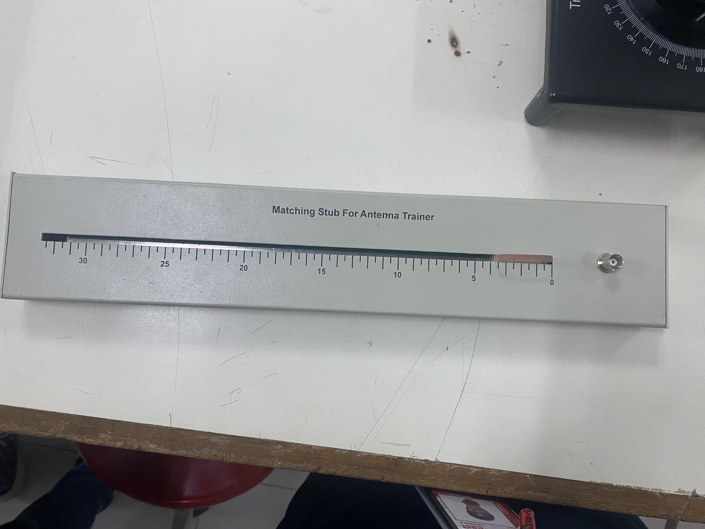
  
  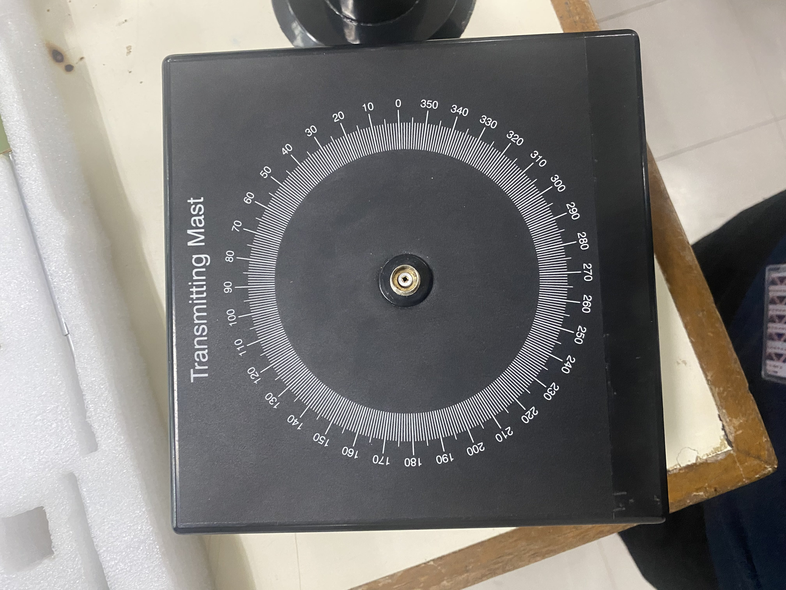
  
  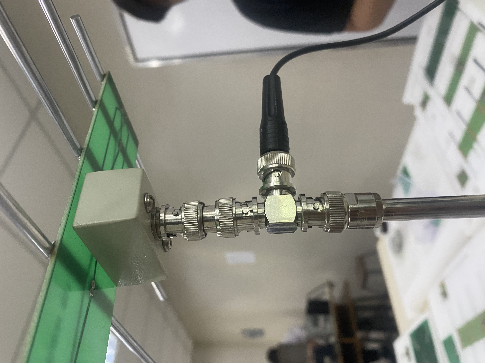
  
  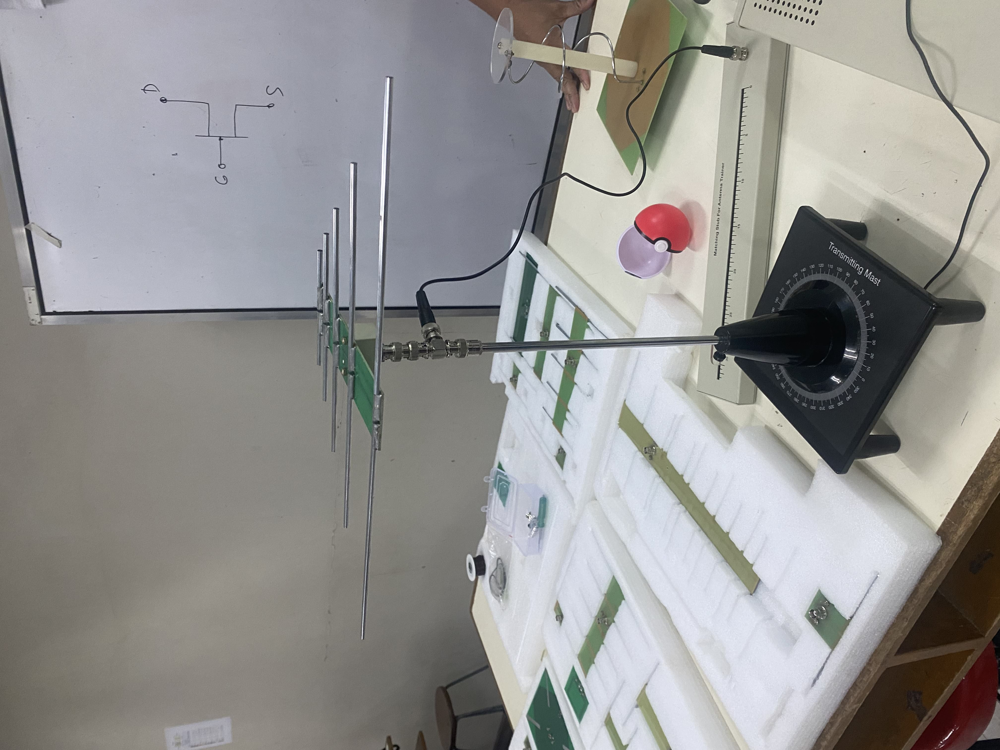
  

### **RECEIVER SETUP**

  
 EQUIPMENTS 

  <!-- Images are located in the LABPICS directory -->
  
  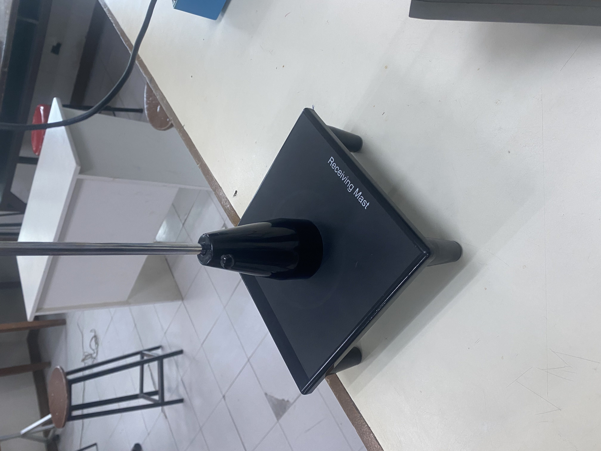
  
  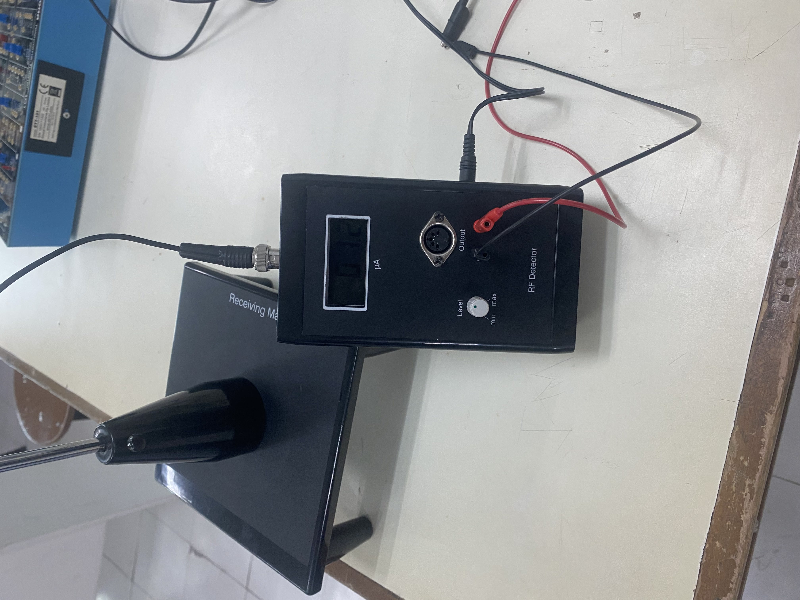
  
  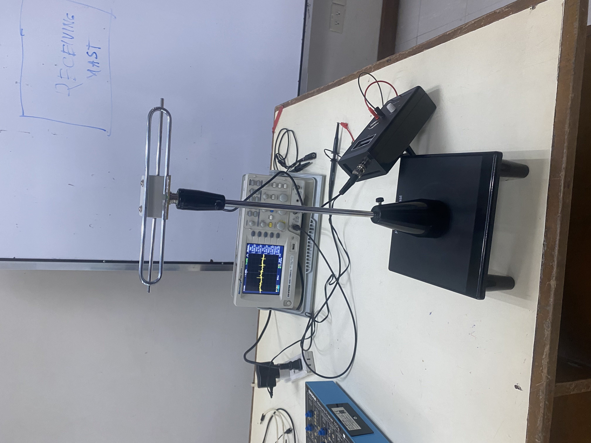
  

### **SETUP AND ITS WAVEFORM**

  
 GUIDE 

  <!-- Images are located in the LABPICS directory -->
  
  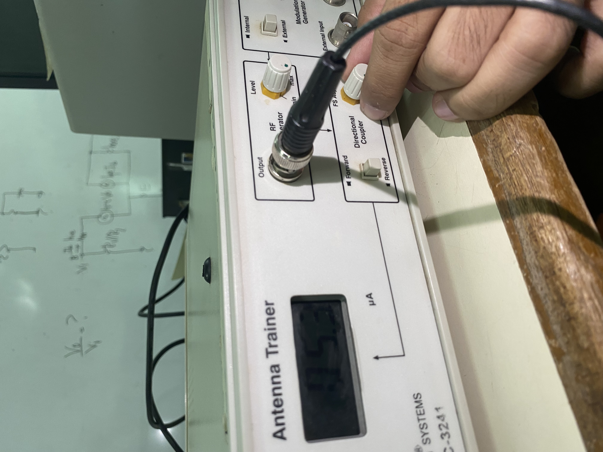
  
  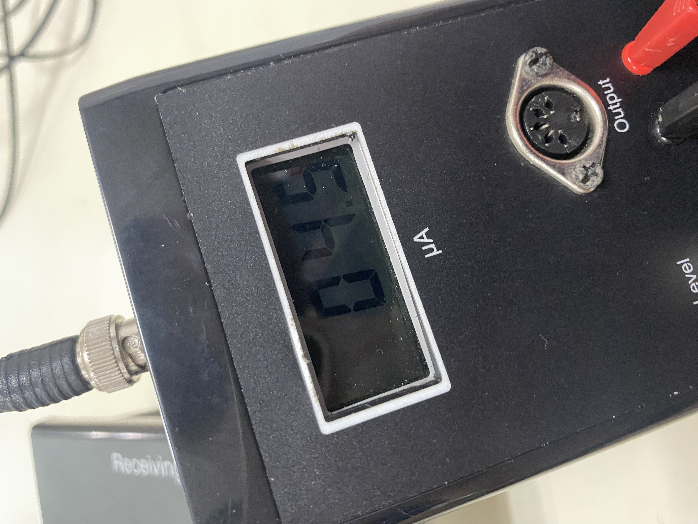
  
  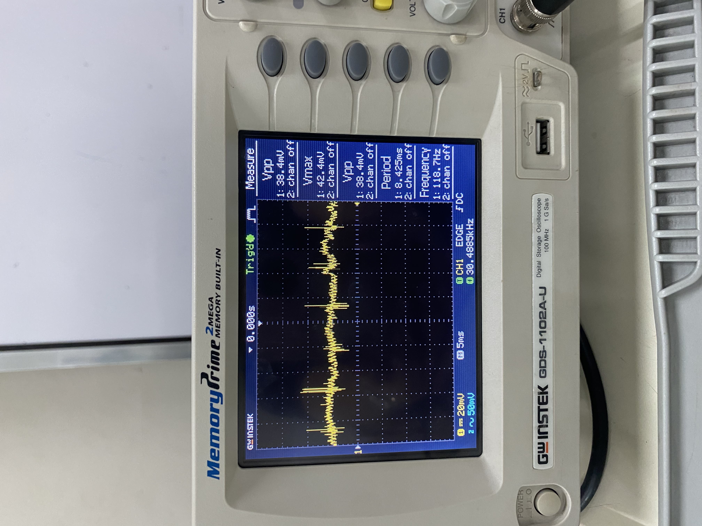

  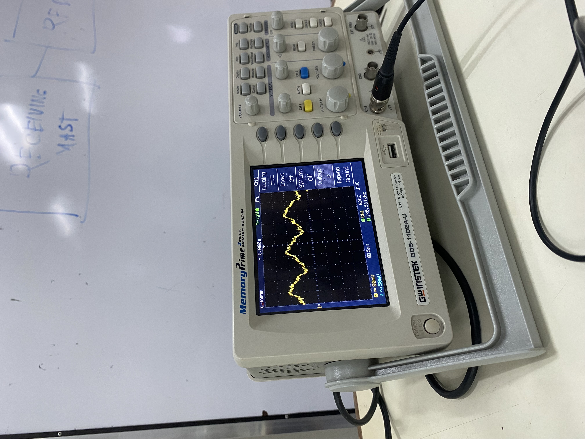
  

# Microwave Engineering: Waveguide Fundamentals

This documentation covers the principles of microwave transmission using rectangular waveguides, specifically focusing on X-band laboratory applications.

## 📡 The Physics of Waveguides

### 1. Geometry & The X-Band Standard
Unlike coaxial cables, a waveguide is a single-conductor hollow pipe. 
- **Internal Reflection:** The signal is contained by "bouncing" off the conductive inner walls.
- **X-Band Dimensions:** Standard laboratory waveguides typically measure **22.86 mm (a)** by **10.16 mm (b)**. 
- **Shielding:** The enclosed metallic structure prevents radiation leakage and protects the signal from external EMI.

### 2. The Cutoff Phenomenon ($f_c$)
A waveguide acts as a natural **High-Pass Filter**. It will only transmit signals if the wavelength is small enough to propagate through the aperture.
- **Dominant Mode Calculation:** The cutoff wavelength is defined as $\lambda_c = 2a$.
- **Operating Range:** Frequencies below $f_c$ cannot travel through the guide and are attenuated immediately.

### 3. Propagation Modes
Waves travel in specific geometric patterns known as modes:

| Mode | Name | Description |
| :--- | :--- | :--- |
| **TE** | Transverse Electric | The $E$-field is perpendicular to the direction of travel. |
| **TM** | Transverse Magnetic | The $H$-field is perpendicular to the direction of travel. |
| **$TE_{10}$**| Dominant Mode | The standard operating mode for rectangular waveguides. |
| **TEM** | Transverse EM | **Cannot exist** in hollow waveguides; requires two conductors. |

## 🛠️ Laboratory Observations
In the X-band bench, the **$TE_{10}$** mode is utilized because it offers the widest usable frequency range between the first and second cutoff frequencies, ensuring stable, single-mode propagation.

---
# Microwave Measurement & Detection Systems

Documentation for the characterization of Standing Waves and Impedance Matching in X-Band waveguides.

## 🛠️ Measurement Instrumentation

### 1. Slotted Line (8.2 – 12.4 GHz)
The fundamental tool for analyzing **Standing Waves**.
- **Mechanism:** A movable probe samples the electric field along the waveguide's length.
- **Application:** Used to locate the peaks ($V_{max}$) and valleys ($V_{min}$) necessary to calculate VSWR and load impedance.

### 2. Slide Screw Tuner
A precision instrument used for **Impedance Matching**.
- **Adjustment:** Allows for variable probe depth and longitudinal position.
- **Function:** Introduces a compensating reflection to cancel out standing waves, ensuring maximum power delivery to the load.

### 3. Crystal Detector
The bridge between Microwave (RF) and Measurable (DC) signals.
- **Function:** Rectifies the RF carrier into a low-frequency voltage.
- **Output:** The resulting signal is sent to a VSWR meter or Oscilloscope for visualization and measurement.

### 4. VSWR Meter
A specialized amplifier calibrated for Standing Wave Ratio measurements.
- **Input:** Receives the detected signal from the Slotted Line/Crystal Detector.
- **Metrics:** Displays the ratio of maximum to minimum voltage, providing a direct measurement of system efficiency.

---
### **WAVEGUIDE SETUP**

  
 EQUIPMENTS 

  <!-- Images are located in the LABPICS directory -->
  
  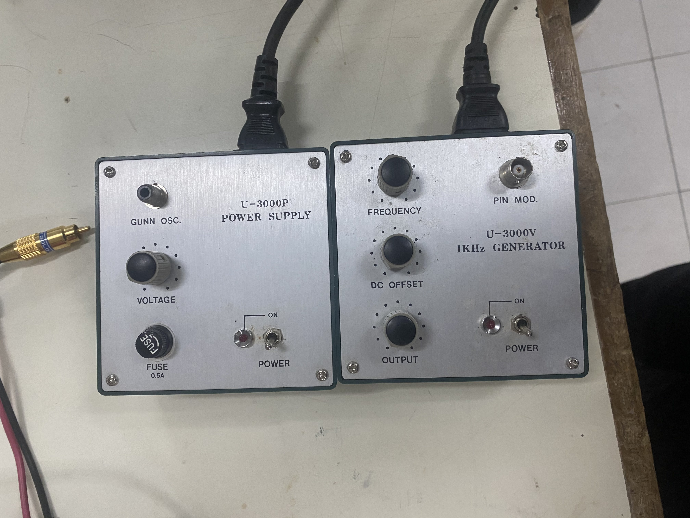
  
  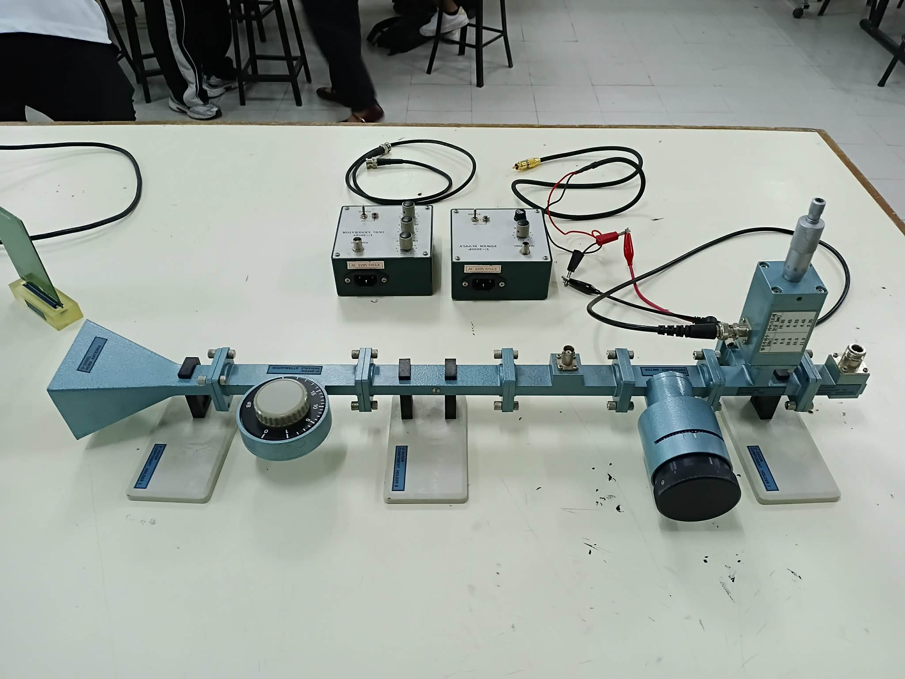
  
  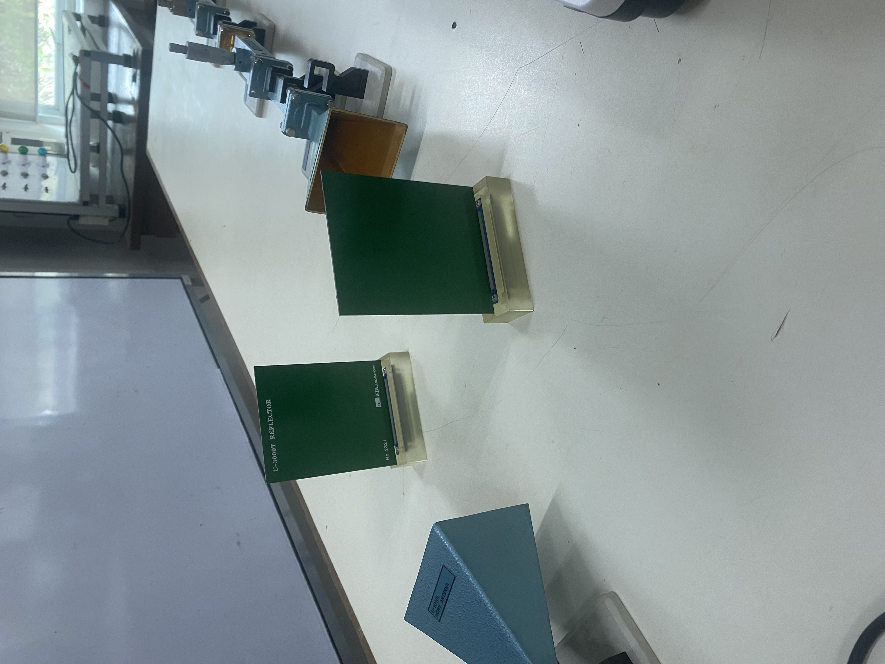
  

### LEARNINGS

Antennas complete this process by acting as the interface between these guided systems and the open air. By varying the physical design—from simple wire rods to complex arrays—we can control exactly how and where energy is radiated. Whether the goal is to broadcast a signal in every direction for local coverage or to focus a narrow beam toward a distant satellite, the geometry of the antenna dictates its effectiveness. This "focusing" of power is what allows modern devices to communicate across vast distances with minimal energy consumption.

Finally, the discipline focuses on the precision of signal measurement and recovery. Because real-world environments often distort waves and cause reflections, specialized tools are used to monitor and correct these "standing wave" errors. In digital communications, this includes using decision-making circuits to "clean up" pulses that have been rounded or smeared during transmission. By understanding these interactions, we can ensure that a message sent as a clear digital bitstream arrives at its destination in its original, perfect form.